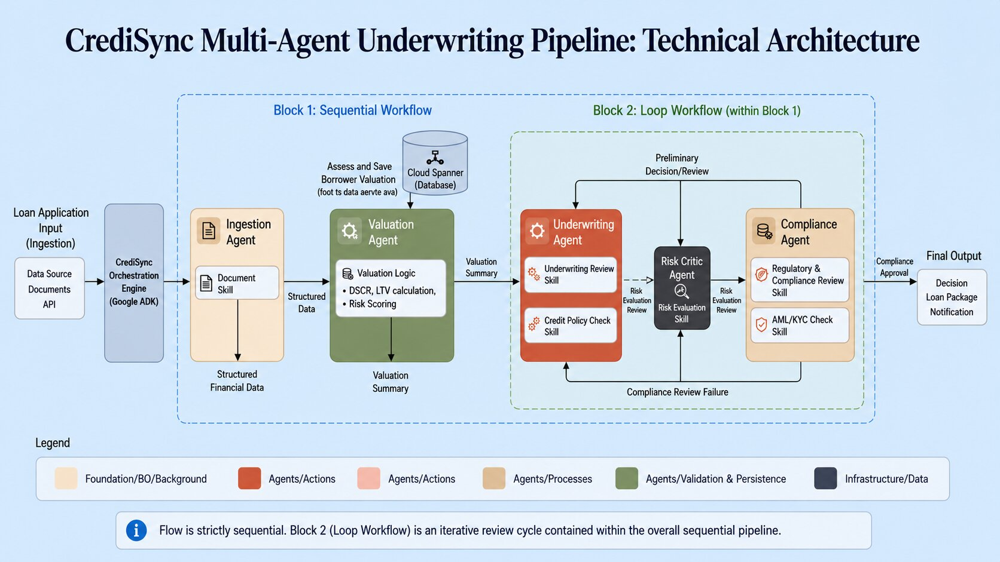
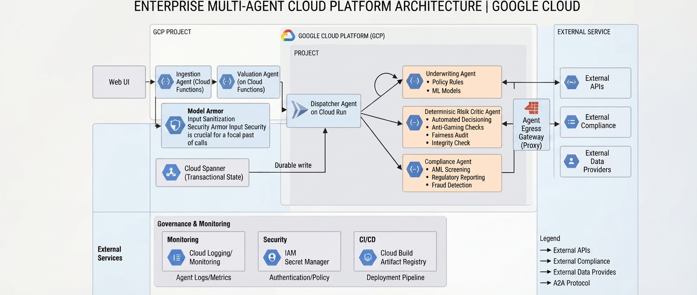

# credisync-underwriting

An enterprise multi-agent credit scoring, financial valuation, and risk underwriting platform built with Google's Agent Development Kit (ADK) and Agent-to-Agent (A2A) protocol. It features a team of specialized microservice agents that ingest loan applications, evaluate borrower solvency, enforce compliance guardrails and score financial risks, orchestrated to deliver robust automated lending packages for financial service providers.

---

## 🏗️ Multi-Agent Workflow Architecture

The orchestration logic is structured around sequential, parallel, and loop primitives using ADK. The **Dispatcher** coordinates document ingestion and valuation concurrently, followed by an iterative underwriting and compliance review loop:



---

## ☁️ Enterprise Cloud Infrastructure

The high-level cloud deployment topology outlines the integration across Google Cloud Run, Cloud Functions, external APIs, and secure A2A communication channels:



---

## Micro Services Architecture
This project uses a distributed microservices architecture where each agent runs in its own container and communicates securely via the Agent-2-Agent (A2A) protocol over HTTP:

- **Dispatcher Service (`dispatcher`)**: Summarizes the lending package, manages workflow coordination using `LoopAgent`, `SequentialAgent`, and `RemoteA2aAgent` and writes the final output to a shared cloud workspace.
- **Ingestion Service (`ingestion`)**: Accepts and parses unstructured financial documents uploaded by loan applicants, such as tax returns and bank statements with Model Armor input sanitization.
- **Valuation Service (`valuation`)**: Reaches out to external APIs such as credit bureaus and property appraisers to evaluate borrower risk.
- **Underwriting Service (`underwriting`)**: Accesses private database tables in BigQuery containing client transaction records to perform institutional risk scoring.
- **Compliance Service (`compliance_agent`):** Acts as the final regulatory and policy gatekeeper, validating underwriting packages against statutory lending limits, checking AML/sanctions criteria, and generating immutable audit traces.
- **Agent App (`app`)**: A web application that queries the dispatcher agent, displays progress, and renders performance waterfall analytics via Cloud Shell Web Preview.

---
## Project Structure
```
credisync-underwriting/
├── agents/                  # Contains individual agent directories and SKILL.md files
│   ├── ingestion_agent/
│   ├── underwriting_agent/
│   ├── valuation_agent/
|   ├── compliance_agent/
│   └── dispatcher_agent/
├── shared/                  # Common schemas, Pydantic models, and A2A protocol helpers
├── config/                  # Cloud Run deployment configs & environment variables
└── main.py                  # Orchestration entrypoint
```

### Shared Files
The `shared/` directory contains core modules shared across all agents and the web application. To eliminate code duplication, these files can be linked into respective subdirectories as [**symlinks**](https://en.wikipedia.org/wiki/Symbolic_link):
- `a2a_utils.py` – Contains code for rewriting agent URLs in A2A AgentCards when deployed in Google Cloud Run.
- `adk_app.py` – ADK API Service implementation with built-in A2A functionality and lifecycle hook management (`ToolContext`/ `CallbackContext`).
- `authenticated_httpx.py` – [httpx](https://www.python-httpx.org/) client extension configured for secure [service-to-service requests](https://docs.cloud.google.com/run/docs/authenticating/service-to-service) with OIDC ID tokens.

---
## Requirements

*   **uv**: Python package manager (required for local development).
*   **Google Cloud SDK**: Required for GCP service authentication, secret management, and Cloud Run deployments

## Quick Start

1.  **Install Dependencies:**
    ```bash
    uv sync
    ```

2.  **Set up credentials:**
    Ensure you have Google Cloud credentials available. You might need to run:
    ```bash
    gcloud auth application-default login
    ```
    And ensure your `GOOGLE_CLOUD_PROJECT` environment variable is set.

3.  **Run Locally:**
    ```bash
    ./run_local.sh
    ```
    This will start the individual microservices and the web app processes concurrently.

4.  **Access the App:**
    Open **http://localhost:8000** in your browser.

## Deployment

To deploy to Google Cloud Run, containerize and deploy each service individually, then configure the Dispatcher/Orchestrator service with the secure endpoint URLs of the downstream microservices.

1.  **Deploy Microservices:**
    Deploy the `ingestion/`, `valuation/`, `underwriting/`,`compliance/` and `dispatcher/` folders as separate Cloud Run services. Note down their assigned HTTPS service URLs (e.g., `[https://ingestion-xyz.a.run.app](https://ingestion-xyz.a.run.app)`)..

2.  **Deploy Agent App:**
    Deploy the `app/` folder to Cloud Run and configure the following environment variables to wire up the Agent-to-Agent network via AgentCards:
    *   `INGESTION_AGENT_CARD_URL`: `https://<ingestion-url>/a2a/agent/.well-known/agent.json`
    *   `VALUATION_AGENT_CARD_URL`: `https://<valuation-url>/a2a/agent/.well-known/agent.json`
    *   `UNDERWRITING_AGENT_CARD_URL`: `https://<underwriting-url>/a2a/agent/.well-known/agent.json`
    *   `COMPLIANCE_AGENT_CARD_URL`: `https://<compliance-url>/a2a/agent/.well-known/agent.json`
    *   `AGENT_URL`: `https://<dispatcher-url>`

3.  **Access:**
    Open the App's URL in your browser.


